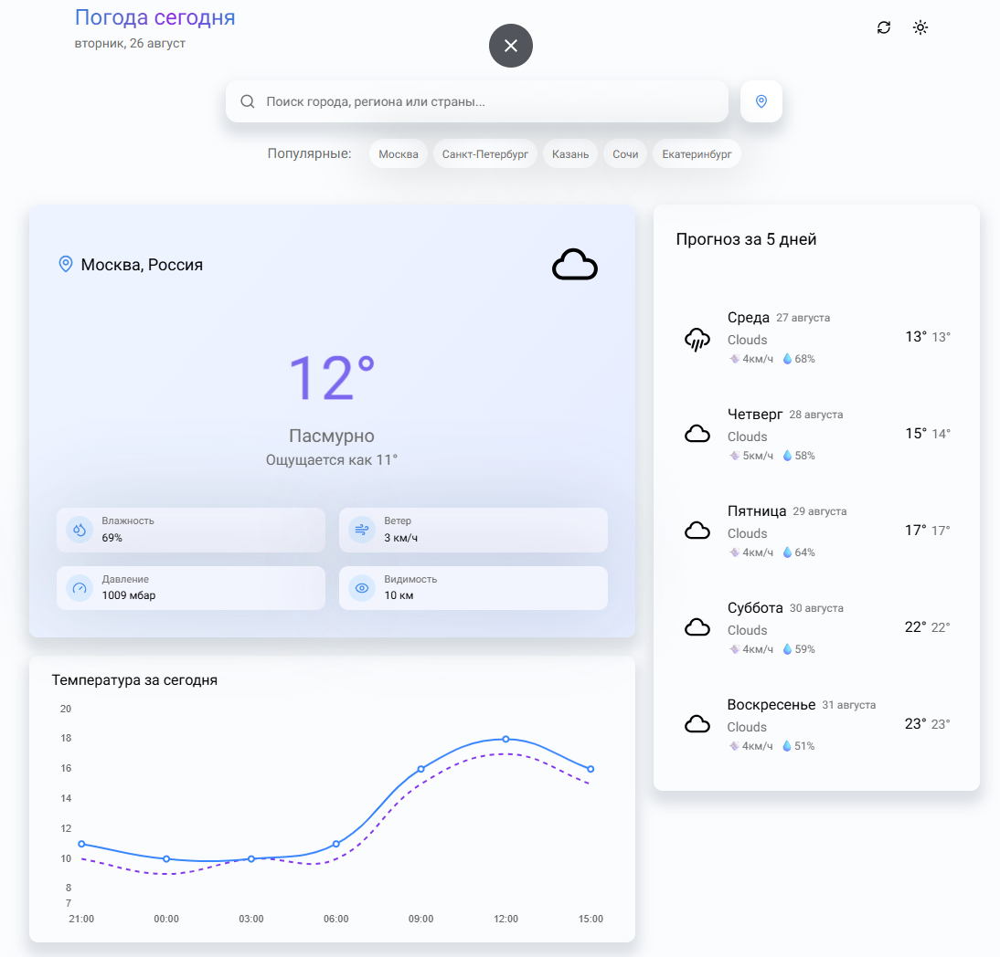
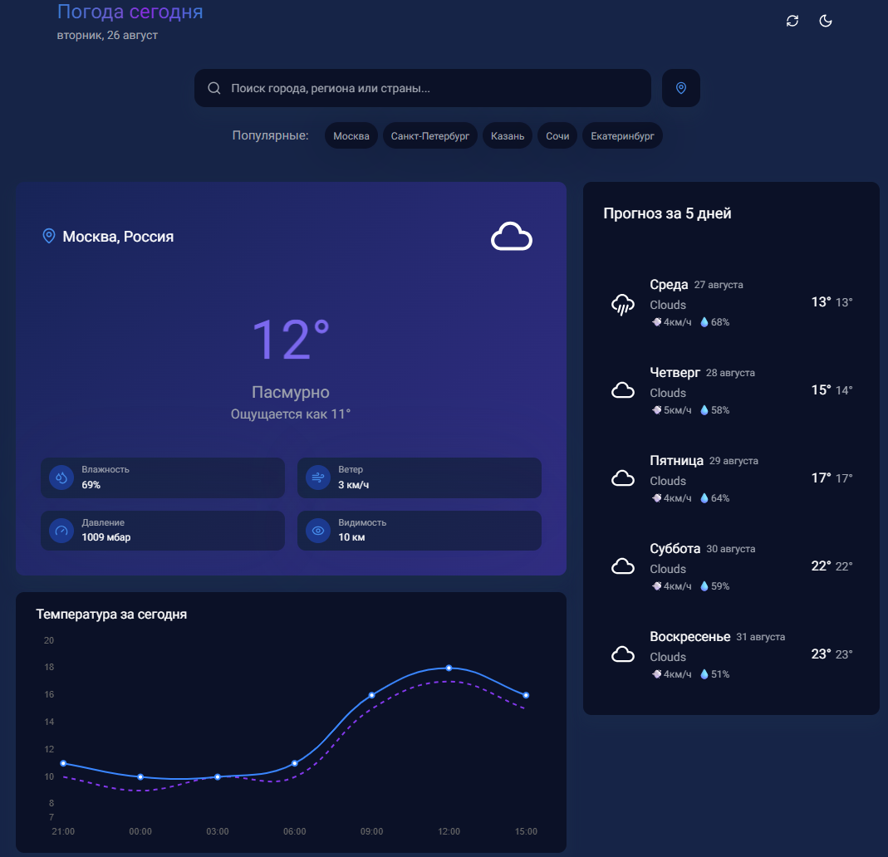

# ⛅ Weather App

A modern Weather App built with JavaScript and Vite that fetches real-time weather data from the OpenWeatherMap API.
Users can search for any city and instantly see current conditions with a clean, responsive, and interactive UI.

---

## 🚀 Features

- 🌍 Real-time weather data (temperature, humidity, description, etc.)
- 📅 5-day forecast with daily conditions
- 📊 Hourly temperature chart (using Chart.js)
- 🔍 Search with autocomplete suggestions
- 🎨 Dark mode support
- 🌈 Animated weather icons
- 📱 Responsive design (mobile-friendly)
- ⚡ Fast development and optimized build with Vite

---

## 🛠️ Technologies

- Vite — fast bundler & dev server
- JavaScript (ES6+) — core logic
- HTML5 — semantic structure
- Sass (SCSS) — styling with variables & nesting
- OpenWeatherMap API — weather data source
- Chart.js — interactive charts for hourly temperatures
- Animated weather icons library (e.g., Weather Icons or similar)

---

## 🌍 How It Works

1. User enters a city name.
2. Autocomplete shows possible matches.
3. The app sends a request to OpenWeatherMap API.
4. Displays:
    - 🌡️ Current weather conditions
    - 📅 5-day forecast (daily)
    - 📊 Hourly temperature chart (visualized with Chart.js)
5. User can switch between light/dark themes.

---

## 🖥️ Installation & Usage
```bash 
# Clone the repository
git clone https://github.com/username/weather-app.git

# Go into the project folder
cd weather-app

# Install dependencies
npm install

# Start the development server
npm run dev

# Build for production
npm run build

# Preview the production build
npm run preview
```
---
## 📸 Screenshots

| 🌙 Dark Theme                                  | ☀️ Light Theme                               |
|------------------------------------------------|----------------------------------------------|
|  |  |

---

Author: [@khusainovilas](https://github.com/khusainovilas)


